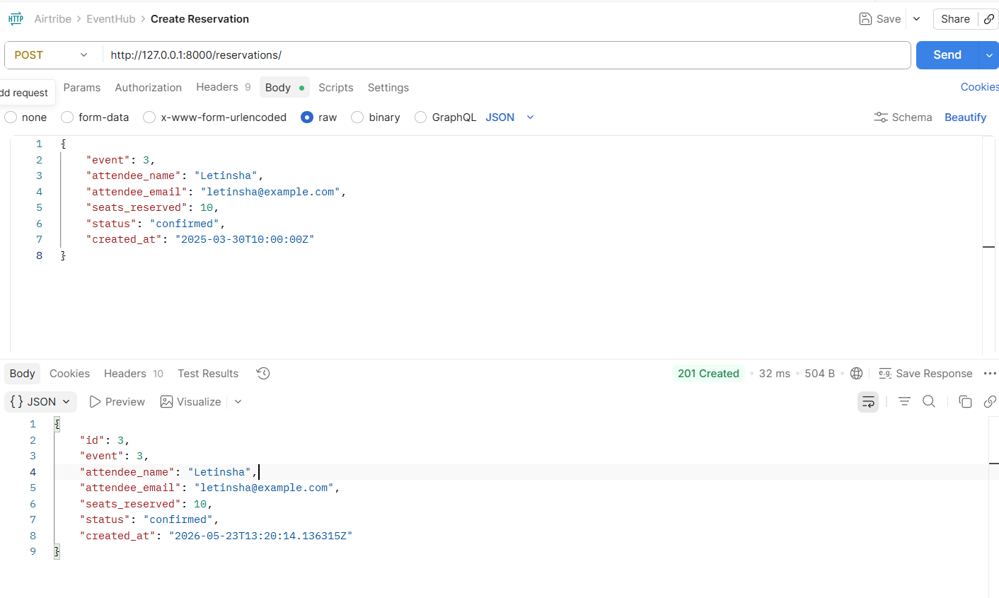
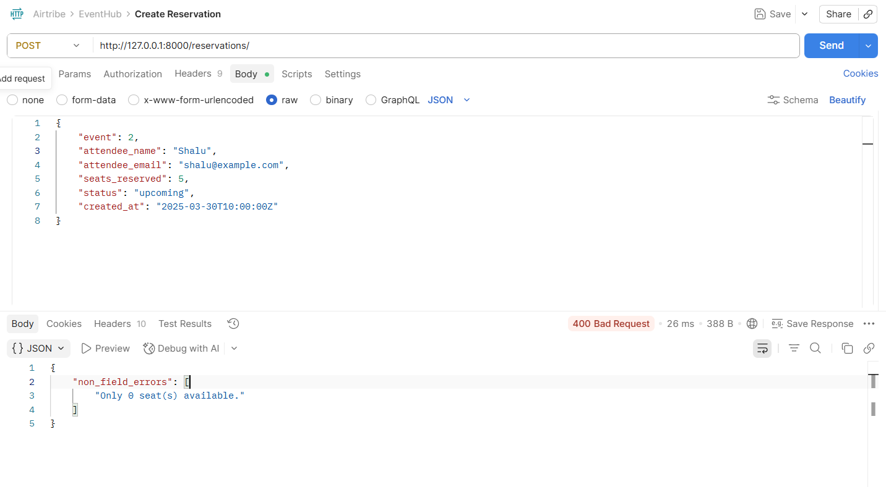
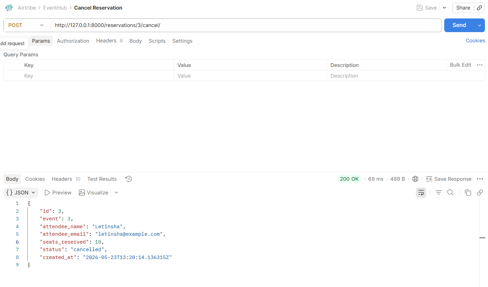

# EventHub

REST API for managing events and seat reservations, built with Django 6 and Django REST Framework.

## Prerequisites

- Python 3.12+ (3.14 supported with `psycopg[binary]>=3.2.10`)
- Docker Desktop (for PostgreSQL 18.3)

## How to run the project

### 1. Clone and set up the virtual environment

From the repository root (`EventHub/`):

```powershell
python -m venv .venv
.\.venv\Scripts\Activate.ps1
pip install -r eventhub\requirements.txt
```

On Python 3.14, if `psycopg[binary]==3.2.9` fails to install, use:

```powershell
pip install "psycopg[binary]>=3.2.10"
```

### 2. Start PostgreSQL

From the `eventhub/` directory:

```powershell
cd eventhub
docker compose up -d
```

This starts PostgreSQL **18.3** with data stored under `/var/lib/postgresql` (the PostgreSQL 18+ volume layout).

Default database credentials (override via environment variables or `.env`):

| Variable | Default |
|----------|---------|
| `POSTGRES_USER` | `eventhub` |
| `POSTGRES_PASSWORD` | `eventhub` |
| `POSTGRES_DB` | `eventhub` |
| `POSTGRES_HOST` | `localhost` |
| `POSTGRES_PORT` | `5432` |

Copy `.env.example` to `.env` if you want to customize values.

### 3. Run migrations and start the server

```powershell
python manage.py migrate
python manage.py runserver
```

The API is available at **http://127.0.0.1:8000/**

### 4. Logs

Request logs from `RequestLoggingMiddleware` are written to:

- **Console** — the terminal running `runserver`
- **File** — `eventhub/logs/eventhub.log`

Restart the dev server after changing logging settings in `eventhub/settings.py`.

---

## API endpoints

Base URL: `http://127.0.0.1:8000`

### Events (`/events/`)

| Method | URL | Description |
|--------|-----|-------------|
| `GET` | `/events/` | List all events. Optional query params: `?status=upcoming` and `?venue=hall` (partial, case-insensitive venue match). |
| `POST` | `/events/` | Create a new event. |
| `GET` | `/events/{id}/` | Retrieve a single event (includes `reservations_count` for confirmed reservations). |
| `PUT` | `/events/{id}/` | Replace an event (all writable fields required). |
| `PATCH` | `/events/{id}/` | Partially update an event. |
| `DELETE` | `/events/{id}/` | Delete an event and its reservations (cascade). |

**Create event example**

```json
POST /events/
{
  "title": "Python Meetup",
  "venue": "Tech Hall A",
  "date": "2026-06-15",
  "total_seats": 100,
  "available_seats": 100,
  "status": "upcoming"
}
```

Validation: `available_seats` cannot exceed `total_seats`.

---

### Reservations (`/reservations/`)

| Method | URL | Description |
|--------|-----|-------------|
| `GET` | `/reservations/` | List all reservations. Optional query param: `?event_id=1` to filter by event. |
| `POST` | `/reservations/` | Create a reservation and decrement the event’s `available_seats`. |
| `GET` | `/reservations/{id}/` | Retrieve a single reservation. |
| `PUT` | `/reservations/{id}/` | Replace a reservation. |
| `PATCH` | `/reservations/{id}/` | Partially update a reservation. |
| `DELETE` | `/reservations/{id}/` | Delete a reservation. |

| Method | URL | Description |
|--------|-----|-------------|
| `POST` | `/reservations/{id}/cancel/` | Cancel a confirmed reservation and restore seats to the event. Returns `400` if already cancelled. |

**Create reservation example**

```json
POST /reservations/
{
  "event": 1,
  "attendee_name": "Jane Doe",
  "attendee_email": "jane@example.com",
  "seats_reserved": 2
}
```

Validation:

- At least 1 seat must be reserved.
- Event must be `upcoming` or `ongoing`.
- `seats_reserved` cannot exceed the event’s `available_seats`.
- `status` and `created_at` are read-only on create.

---

### Admin

| Method | URL | Description |
|--------|-----|-------------|
| * | `/admin/` | Django admin interface (create a superuser with `python manage.py createsuperuser`). |

---

## Design decision: denormalized `available_seats` on `Event`

**Decision:** Store `available_seats` on the `Event` model and update it when reservations are created or cancelled, instead of computing availability with a database aggregate on every booking (`total_seats − SUM(confirmed seats)`).

**Why:**

1. **Fast reads** — Listing events and checking capacity is a single field lookup, with no join or aggregation per request.
2. **Simple API validation** — Serializers can compare `seats_reserved` to `event.available_seats` directly.
3. **Clear booking flow** — Seat count is decremented in `ReservationSerializer.create()` and restored in the `cancel` action, keeping write paths explicit.

**Trade-off:** Seat counts must stay in sync with reservations. All seat changes go through the serializer `create()` path and the `cancel` action so updates stay centralized; direct DB edits could drift counts.

---

## Project structure

```
eventhub/
├── docker-compose.yml      # PostgreSQL 18.3
├── docker/postgres/init/   # DB bootstrap on first run
├── eventhub/               # Django project (settings, urls)
├── events/                 # Events & reservations app
├── logs/                   # Application log file (generated at runtime)
├── manage.py
└── requirements.txt
```

```
Screenshots
# Successful reservation (201 Created)



# Overbooking failure (400 Bad Request)



# Successful cancellation

```